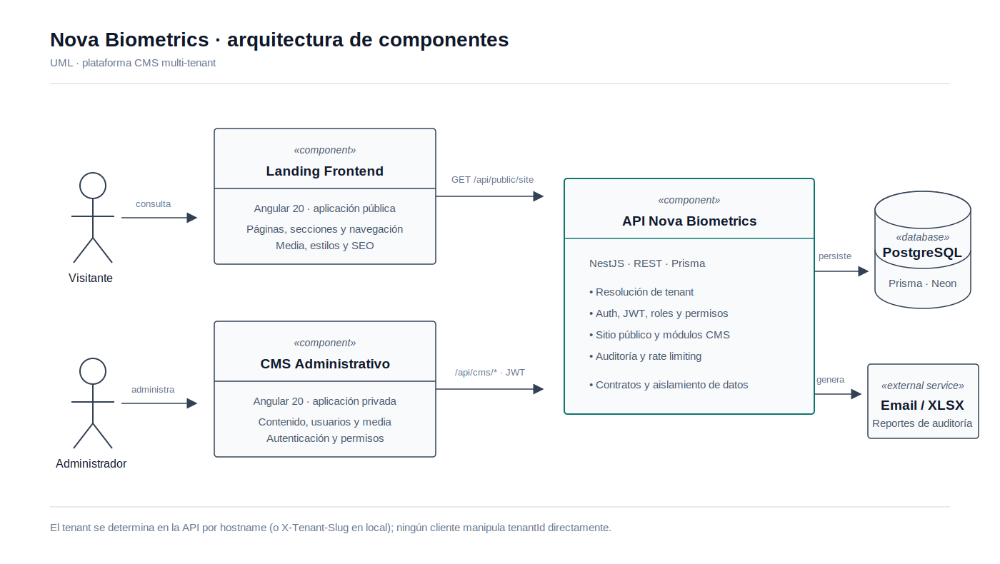
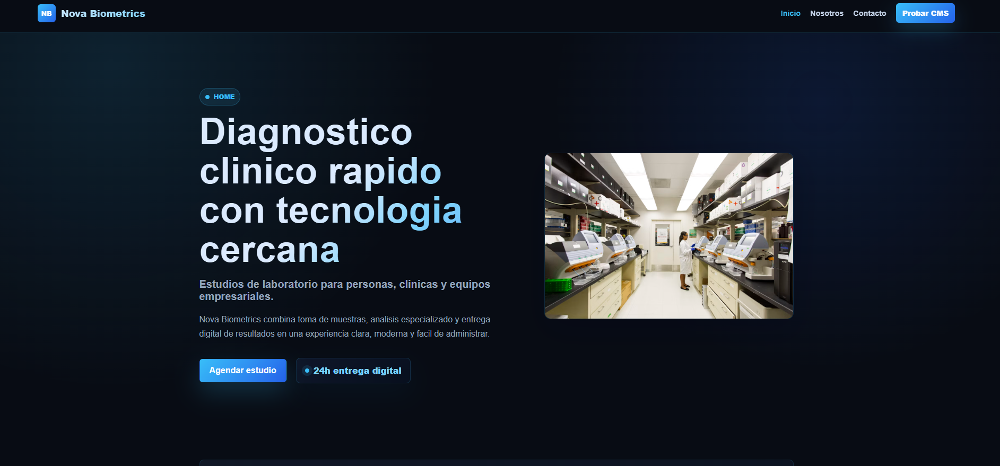
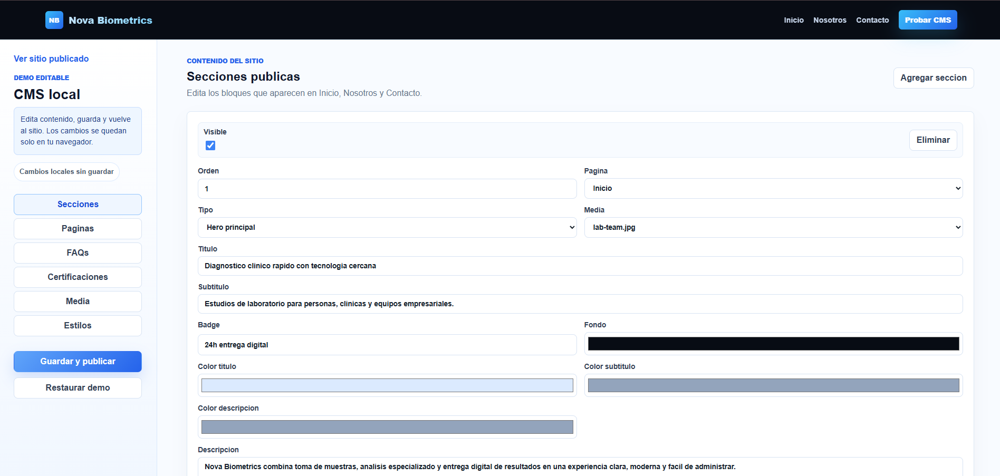

# Nova Biometrics Frontend

A modern Angular 20 frontend for showcasing a configurable public site and a lightweight CMS demo. The project is designed to present tenant-specific content, navigation, sections, certifications, FAQs, and media assets in a polished, maintainable way.

## Overview

- Built with Angular 20 and standalone components
- Uses environment-based configurations for local, stage, and production setups
- Includes a demo CMS flow for editing content directly in the browser
- Ready for deployment to Vercel with a static SPA rewrite configuration

## Arquitectura general



Nova Biometrics es una plataforma CMS multi-tenant compuesta por dos aplicaciones Angular independientes: una landing pública, optimizada para mostrar contenido, y un panel CMS protegido para administrarlo. Ambas consumen una API NestJS compartida, responsable de resolver el tenant, aplicar autenticación y permisos, exponer los contratos REST y persistir la configuración de cada negocio en PostgreSQL mediante Prisma. Así, una nueva landing se crea por configuración de tenant y contenido, sin duplicar el frontend ni el esquema de datos.

### Modo demostración

Este frontend está preparado para integrarse con la arquitectura descrita y consumir los contratos de la API. Para que pueda ejecutarse y mostrarse de forma independiente en este repositorio, actualmente utiliza datos mock que simulan la respuesta del sitio público; por ello, la experiencia visual y de navegación funciona sin requerir la API, el CMS ni la base de datos activos.

## Tech Stack

- Angular 20
- TypeScript
- RxJS
- SCSS
- Vercel deployment configuration

## Project Structure

```text
src/
├── app/
│   ├── core/               # shared infrastructure and interceptors
│   ├── data-access/        # DTOs, repositories, adapters, and API sources
│   ├── features/
│   │   ├── cms/            # CMS demo pages and editing flow
│   │   └── site/           # public site rendering and navigation
│   └── shared/             # reusable pipes and helpers
├── environments/           # environment-specific config files
└── styles.scss             # global styles
```

## Getting Started

### 1. Install dependencies

```bash
npm install
```

### 2. Run the development server

```bash
npm start
```

The app will be available at:

- http://localhost:4200

### 3. Build for production

```bash
npm run build
```

## Available Scripts

```bash
npm start           # start the development server
npm run start:local # start with local environment config
npm run start:stage # start with stage environment config
npm run build       # production build
npm run build:local # local build
npm run build:stage # stage build
npm test            # run unit tests
```

## Environment Configuration

The project includes multiple environment files:

- `src/environments/environment.ts` for default development settings
- `src/environments/environment.local.ts` for local testing
- `src/environments/environment.stage.ts` for staging
- `src/environments/environment.production.ts` for production

## Screenshots

Below is a structured section for showcasing the most important views of the application.

### Homepage



A complete view of the public landing page, including the hero section, navigation, and main call-to-action areas.

### CMS Demo


A preview of the CMS experience for editing sections, texts, and layout content.

## Deployment

The frontend is configured for deployment on Vercel using [vercel.json](vercel.json).

## Notes

This repository focuses on the frontend presentation layer. If you are working with the API or CMS backend, refer to the related backend documentation in the workspace for full end-to-end setup instructions.
